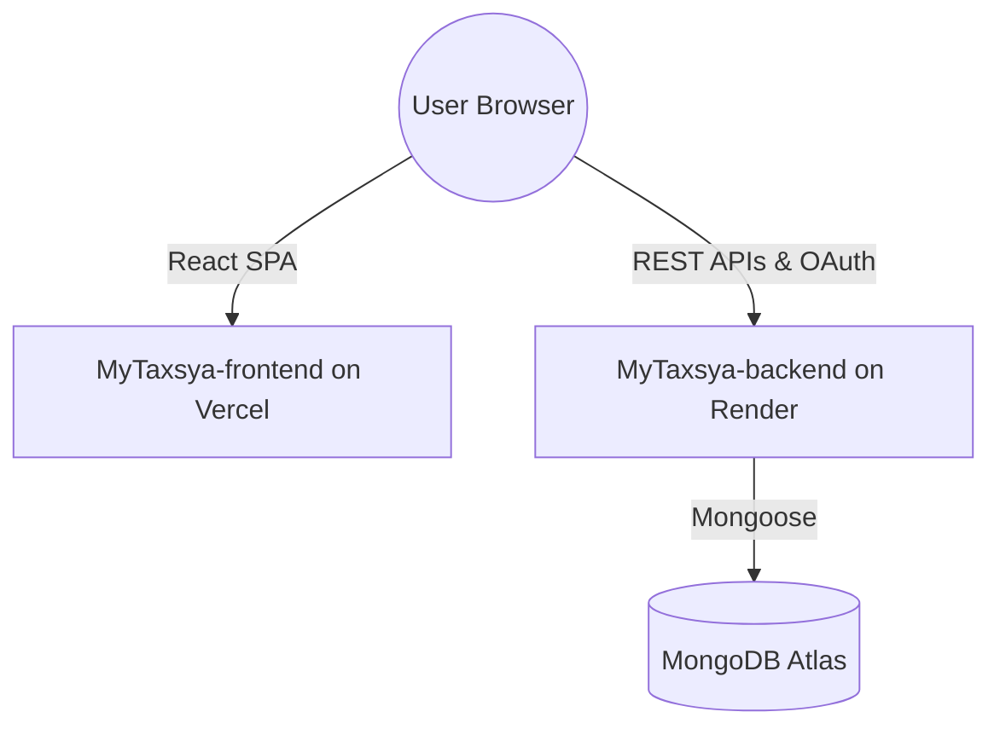

# MyTaxsya Deployment Guide

This guide details how to deploy the separated frontend and backend of **MyTaxsya** to Vercel and Render respectively.

---

## Architecture Overview



---

## 1. Backend Deployment (Render)

Deploy the backend first, as the frontend needs the backend URL for its configuration.

### Host Platform: Render

1. Go to the [Render Dashboard](https://dashboard.render.com/) and click **New > Web Service**.
2. Connect your Git repository.
3. In the creation wizard:
   - **Name**: `mytaxsya-backend`
   - **Root Directory**: `MyTaxsya-backend` *(Very Important)*
   - **Runtime**: `Node`
   - **Build Command**: `npm install`
   - **Start Command**: `npm start`
4. Expand the **Advanced** section to add the environment variables:

| Environment Variable | Description |
| :--- | :--- |
| `NODE_ENV` | Set to `production` |
| `MONGODB_URI` | Your MongoDB Atlas connection string |
| `JWT_SECRET` | Random secret for JWT access tokens, **at least 32 characters** (the server refuses to start in production otherwise) |
| `JWT_REFRESH_SECRET` | Random secret for JWT refresh tokens, at least 32 characters and **different from `JWT_SECRET`** |
| `FRONTEND_URL` | The URL of your deployed frontend (e.g. `https://your-app.vercel.app`) |
| `SMTP_HOST`, `SMTP_PORT`, `SMTP_USER`, `SMTP_PASS` | SMTP account used to send sign-up verification codes, password-reset links and team invites. **Required in production**: without it sign-up fails with a 503 |
| `EMAIL_FROM` | Sender shown on those emails, e.g. `My Taxsya <no-reply@yourdomain.com>` (defaults to `SMTP_USER`) |
| `GOOGLE_CLIENT_ID` | Google OAuth Client ID |
| `GOOGLE_CLIENT_SECRET` | Google OAuth Client Secret |
| `GOOGLE_REDIRECT_URI` | Google OAuth Redirect Callback URI (e.g. `https://your-backend.onrender.com/api/auth/google/callback`) |
| `GEMINI_API_KEY` | Gemini API key used to read invoice/bill images and PDFs. **Enable billing on this key's Google project**: the free tier allows only ~5 requests per minute per model, which throttles bulk imports, and free-tier content may be used by Google to improve its products |
| `GEMINI_MODEL` | (Optional) Main model, default `gemini-3.6-flash` |
| `GEMINI_FALLBACK_MODELS` | (Optional) Comma-separated backup models tried when the main one is rate limited, out of quota or unavailable. Default `gemini-3.5-flash-lite,gemini-3.1-flash-lite`; empty disables fallbacks. Documents read by a backup model are marked *Needs review* |
| `GEMINI_MAX_CONCURRENCY` | (Optional) How many files are read by the AI at the same time, default `6`. **Do not set it to 1** unless you want strictly one-at-a-time uploads. Keep it within your project's rate limit (Google AI Studio -> Rate limits) |
| `GEMINI_THINKING_LEVEL` | (Optional) `minimal` (default), `low`, `medium`, `high` or `default`. Thinking tokens are billed as output; `minimal` cuts the cost of an invoice by about 60% with the same accuracy on our tests |
| `OCR_MAX_CONCURRENCY` | (Optional) Local OCR jobs at once, default `2` (each uses about 60 MB of memory) |
| `OPENAI_API_KEY` | (Optional) OpenAI API key; used only if Gemini is unavailable |

5. Deploy the service and copy the generated service URL (e.g., `https://mytaxsya-backend.onrender.com`). Render supplies `PORT` automatically. Confirm the deployment at `https://your-backend.onrender.com/api/health`; it should return `{ "status": "ok" }`.

---

## 2. Frontend Deployment (Vercel)

Once the backend is live, deploy the frontend.

### Host Platform: Vercel

1. Go to the [Vercel Dashboard](https://vercel.com/) and click **Add New > Project**.
2. Connect your Git repository.
3. In the project settings configuration:
   - **Root Directory**: Select `MyTaxsya-frontend` *(Very Important)*
   - **Framework Preset**: `Vite`
   - **Build Command**: `npm run build`
   - **Output Directory**: `dist`
4. Add the following **Environment Variable**:

| Environment Variable | Value |
| :--- | :--- |
| `VITE_API_URL` | The URL of your deployed backend (e.g., `https://mytaxsya-backend.onrender.com` - do NOT include a trailing `/api` or `/`) |

5. Click **Deploy**. Vercel will build the React app and deploy it.
6. Copy the deployed frontend URL (e.g. `https://mytaxsya.vercel.app`) and make sure you add it to the **`FRONTEND_URL`** environment variable on the Render backend settings.

---

## 3. Google OAuth Setup

Ensure Google OAuth works correctly after the architectural separation:

1. Go to the [Google Cloud Console Credentials Page](https://console.cloud.google.com/apis/credentials).
2. Edit your OAuth 2.0 Client ID.
3. Under **Authorized Javascript Origins**, add:
   - `http://localhost:5175` (local development)
   - `https://your-frontend.vercel.app` (production frontend URL)
4. Under **Authorized Redirect URIs**, add:
   - `http://localhost:5001/api/auth/google/callback` (local development backend redirect)
   - `https://your-backend.onrender.com/api/auth/google/callback` (production backend callback URI)
5. Save changes.

---

## Local Development Flow

To run both services locally concurrently or individually:

### Backend
```bash
cd MyTaxsya-backend
npm install
npm run dev
```

### Frontend
```bash
cd MyTaxsya-frontend
npm install
npm run dev
```
Make sure `MyTaxsya-frontend/.env` is set to `VITE_API_URL=http://localhost:5001`.
