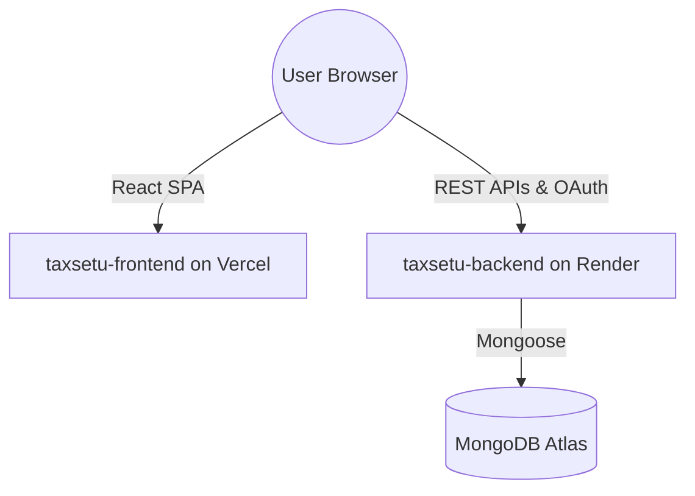

# TaxSetu Deployment Guide

This guide details how to deploy the separated frontend and backend of **TaxSetu** to Vercel and Render respectively.

---

## Architecture Overview



---

## 1. Backend Deployment (Render)

Deploy the backend first, as the frontend needs the backend URL for its configuration.

### Host Platform: Render

1. Go to the [Render Dashboard](https://dashboard.render.com/) and click **New > Web Service**.
2. Connect your Git repository.
3. In the creation wizard:
   - **Name**: `taxsetu-backend`
   - **Root Directory**: `taxsetu-backend` *(Very Important)*
   - **Runtime**: `Node`
   - **Build Command**: `npm install`
   - **Start Command**: `npm start`
4. Expand the **Advanced** section to add the environment variables:

| Environment Variable | Description |
| :--- | :--- |
| `NODE_ENV` | Set to `production` |
| `MONGODB_URI` | Your MongoDB Atlas connection string |
| `JWT_SECRET` | Secret key for generating JWT access tokens |
| `JWT_REFRESH_SECRET` | Secret key for generating JWT refresh tokens |
| `FRONTEND_URL` | The URL of your deployed frontend (e.g. `https://your-app.vercel.app`) |
| `GOOGLE_CLIENT_ID` | Google OAuth Client ID |
| `GOOGLE_CLIENT_SECRET` | Google OAuth Client Secret |
| `GOOGLE_REDIRECT_URI` | Google OAuth Redirect Callback URI (e.g. `https://your-backend.onrender.com/api/auth/google/callback`) |
| `GEMINI_API_KEY` | (Optional) Gemini AI API Key for assistant functionality |
| `OPENAI_API_KEY` | (Optional) OpenAI API key; used only if Gemini is unavailable |

5. Deploy the service and copy the generated service URL (e.g., `https://taxsetu-backend.onrender.com`). Render supplies `PORT` automatically. Confirm the deployment at `https://your-backend.onrender.com/api/health`; it should return `{ "status": "ok" }`.

---

## 2. Frontend Deployment (Vercel)

Once the backend is live, deploy the frontend.

### Host Platform: Vercel

1. Go to the [Vercel Dashboard](https://vercel.com/) and click **Add New > Project**.
2. Connect your Git repository.
3. In the project settings configuration:
   - **Root Directory**: Select `taxsetu-frontend` *(Very Important)*
   - **Framework Preset**: `Vite`
   - **Build Command**: `npm run build`
   - **Output Directory**: `dist`
4. Add the following **Environment Variable**:

| Environment Variable | Value |
| :--- | :--- |
| `VITE_API_URL` | The URL of your deployed backend (e.g., `https://taxsetu-backend.onrender.com` - do NOT include a trailing `/api` or `/`) |

5. Click **Deploy**. Vercel will build the React app and deploy it.
6. Copy the deployed frontend URL (e.g. `https://tax-setu-umy4.vercel.app`) and make sure you add it to the **`FRONTEND_URL`** environment variable on the Render backend settings.

---

## 3. Google OAuth Setup

Ensure Google OAuth works correctly after the architectural separation:

1. Go to the [Google Cloud Console Credentials Page](https://console.cloud.google.com/apis/credentials).
2. Edit your OAuth 2.0 Client ID.
3. Under **Authorized Javascript Origins**, add:
   - `http://localhost:5175` (local development)
   - `https://your-frontend.vercel.app` (production frontend URL)
4. Under **Authorized Redirect URIs**, add:
   - `http://localhost:5001/api/auth/google/callback` (local development backend redirect)
   - `https://your-backend.onrender.com/api/auth/google/callback` (production backend callback URI)
5. Save changes.

---

## Local Development Flow

To run both services locally concurrently or individually:

### Backend
```bash
cd taxsetu-backend
npm install
npm run dev
```

### Frontend
```bash
cd taxsetu-frontend
npm install
npm run dev
```
Make sure `taxsetu-frontend/.env` is set to `VITE_API_URL=http://localhost:5001`.
